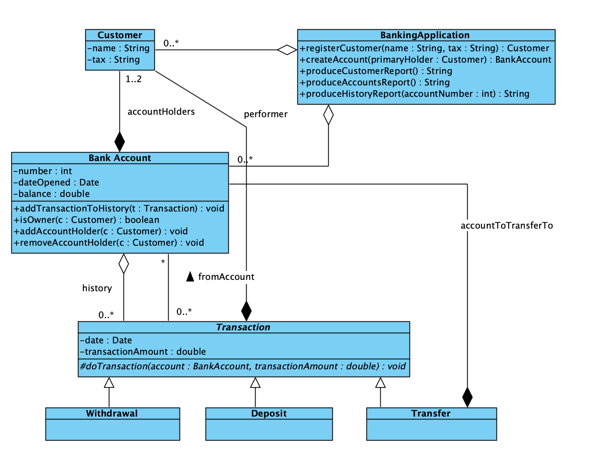

# Banking Application

## Run the app

Run the main located in `MainConsole.java`.

## Brief

You are to develop a banking application that manages information about a bank’s customers, accounts, and transactions. More particularly, the application should allow:

- The registration of a new customer. For reasons of simplicity consider that the only customer information
  recorded is their name and their unique Tax Registry Number (the equivalent of the Greek ΑΦΜ).
- The creation of a new bank account for an existing customer. For each bank account the system
  manages the following information:
    - Account number (unique).
    - The date the account is opened.
    - The account holder(s). An account can have a maximum of two holders. Holders must be existing
      bank customers.
    - The current account balance.
    - The history of transactions performed on the account.
    - The recording of any transaction that takes place in an account. There are three kinds of transactions:
    - Withdrawal of amount from the account (if balance is sufficient).
    - Deposit of an amount to the account
    - Transfer of an amount from one account to another as long as the two accounts share a common
      holder.

Note that for any kind of transaction the system needs to record the date it took place and the account
holder who performed it.

Finally, the application should be able to produce the following reports:
- Customers Report: A list of all customers that includes their personal info and list of accounts they hold.
- Accounts Report: A list of all accounts that includes all generic information relating to each account
  besides their transaction history.
- Account Transaction History: Listing all transactions for a given account.
